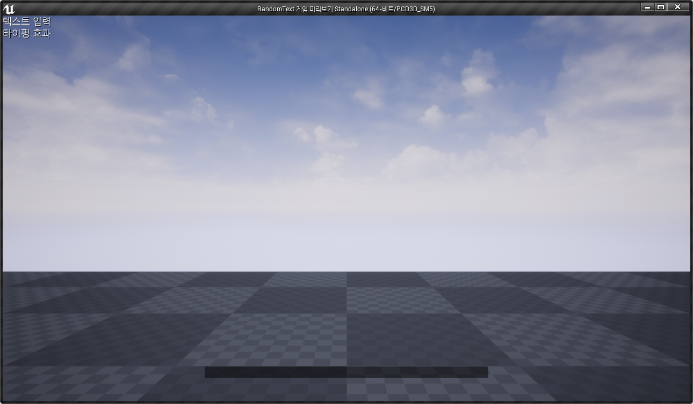

# UE4RandomTypo

######ProjectName.Build.cs

## Add Random Typo

####PublicDependencyModuleNames.AddRange(new string[] { 
####"Core", "CoreUObject", "Engine", "InputCore", "RandomTypo" 
####});
  
 
  
####Text : 변경될 텍스트
####Speed : 랜덤 텍스트 모션 스피드
 ####RandomTypeStart(FString Text, float Speed)

####타이포 변경 델리게이트

####RandomTypoChaged

####타이포 변경 완료 델리게이트 

####RandomTypoCompleted

####EX)

####ARandomTypoEffect *objActor = GetWorld()->SpawnActor<ARandomTypoEffect>();
####objActor->RandomTypeStart(*Text.ToString(), 0.05f);
####AActor* actorObj = Cast<AActor>(objActor);  
####objActor->RandomTypoChaged.BindUObject(this, &URandomTextWidget::RandomTypoChanged , TextObj);
####objActor->RandomTypoCompleted.BindUObject(this, &URandomTextWidget::RandomTypoCompleted, TextObj , actorObj);
